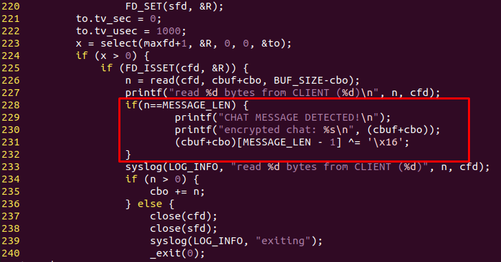
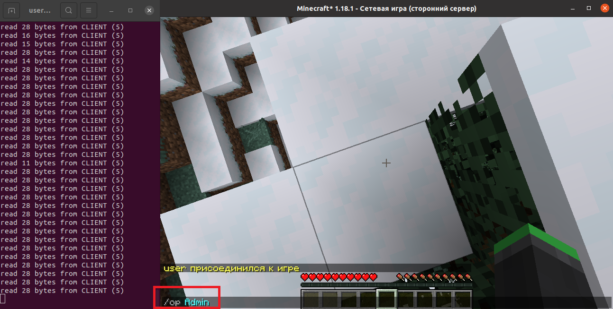
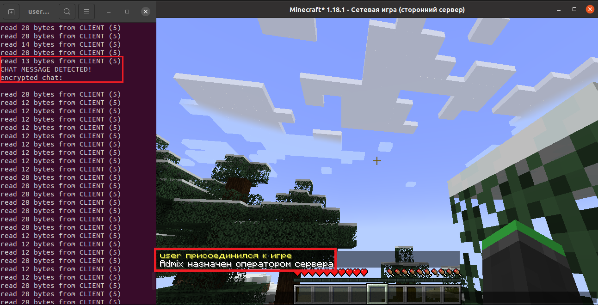
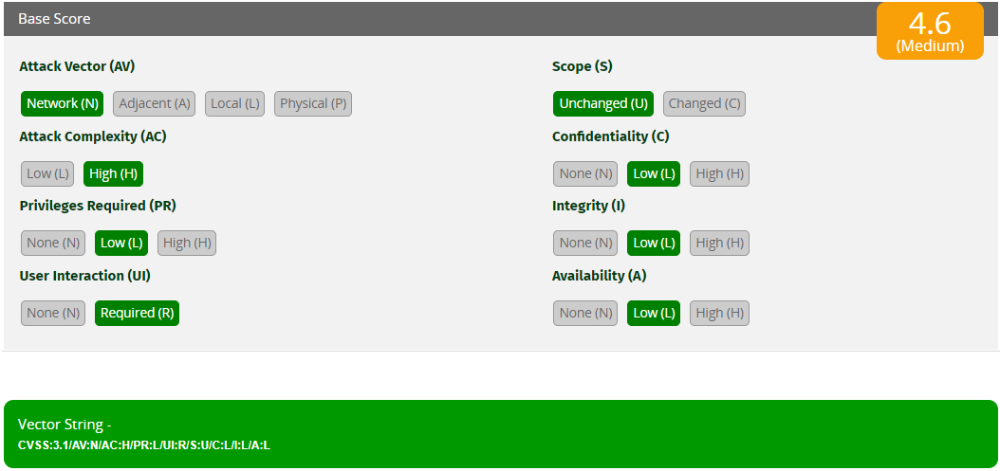

# Minecraft encryption protocol

## Introduction

This course work analyzes the cryptographic messaging protocol of the client-server architecture in the Minecraft 1.18.1. It contains a description of the protocol, its protection algorithms, an analysis of their durability, as well as the implementation of a possible attack on this protocol and an assessment of its danger.

## Attack idea

Since packets are encrypted using the AES/CFB8 algorithm during the game, an attacker capable of manipulating the private text also gets the opportunity to influence the plaintext.

The packet transmitting the message from the in-game terminal consists of one field - the entered raw string.

From the above information , you can implement the following attack:

1. The attacker creates an account with a name formed in such a way that it differs from the name of the administrator of a known server only in the last letter. For example, the administrator's name is ```Admin```, and the attacker's name is ```Admix```.
2. It is required that a real administrator connects to the malicious server of the attacker, which is a simple proxy that redirects all data to the real server.
3. The administrator must execute the ```/op Admin``` command, which grants administrator rights to the Admin user.
4. The proxy modifies the last byte received so that the real server receives the ```/op Admix``` command.
5. The attacker gets administrator rights on the real server.

## Demonstration stand

[Demonstration stand](https://drive.google.com/file/d/12Q-5V7gWPFrrEHhuc1JCKkHadj35wTby/view?usp=drive_link)

The following software is used to exploit the vulnerability:

+ Minecraft 1.18.1 (release date: 10 December 2021);
+ Paper - Minecraft game server;
+ [simple-tcp-proxy](https://github.com/wessels/simple-tcp-proxy) - proxy server.

## Proof of concept

First you need to modify the proxy. To implement the substitution of the last byte in the proxy source code, you need to add the following few lines:

You need to run Minecraft and the Paper game server. Starting the game server:

```bash
java -jar paper-1.18.1-216.jar
```

Then you need to start proxy:

```bash
./simple-tcp-proxy 127.0.0.1 20000 127.0.0.1 25565
```

Next, in the terminal of the game, enter the command ```/op Admin```:



After sending the command, the administrator rights are assigned to a user named ```Admix```:



## Risk assessment of vulnerability

The assessment of the described vulnerability was carried out using the CVSS v3.1 system and amounted to ```4.6```, which corresponds to the average level of danger.



The successful exploitation of the described vulnerability depends not only on the actions of the attacker, but also on the victim – the administrator, which significantly complicates the implementation of the attack. Also, the rights obtained during the exploitation of the vulnerability have a limited impact on the confidentiality, integrity and availability of information. From this it follows that the above factors make the described attack inexpedient in terms of costs or impossible at all.
